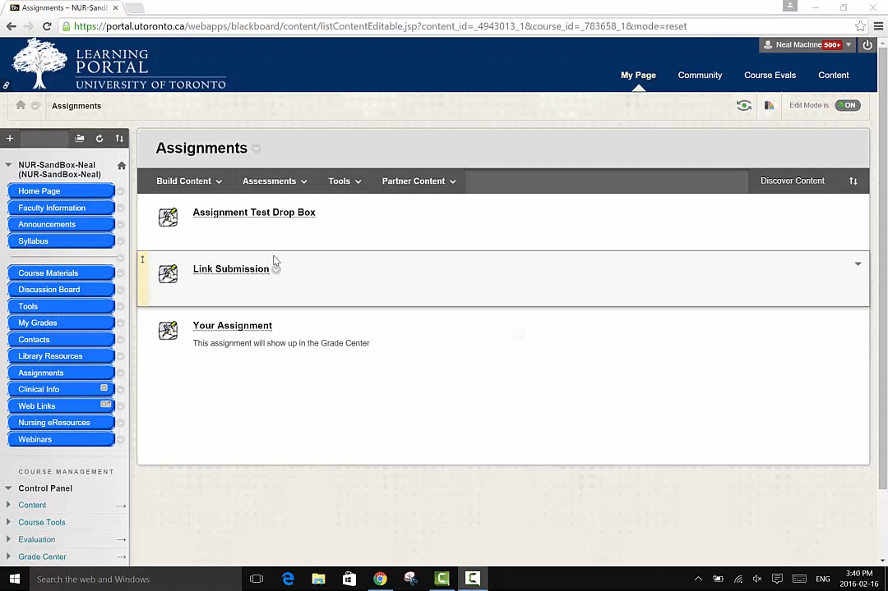
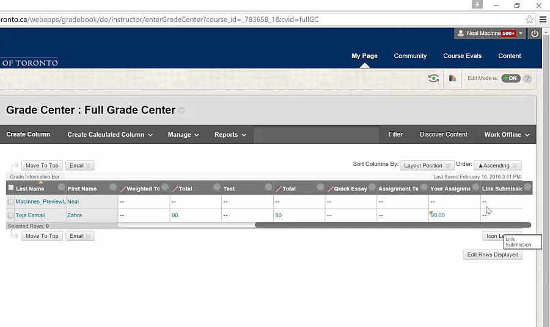
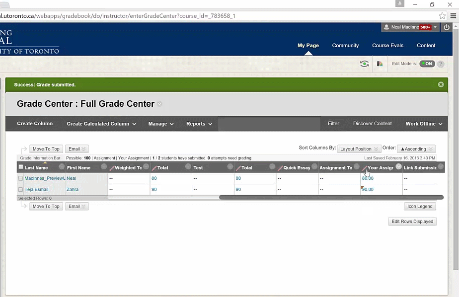
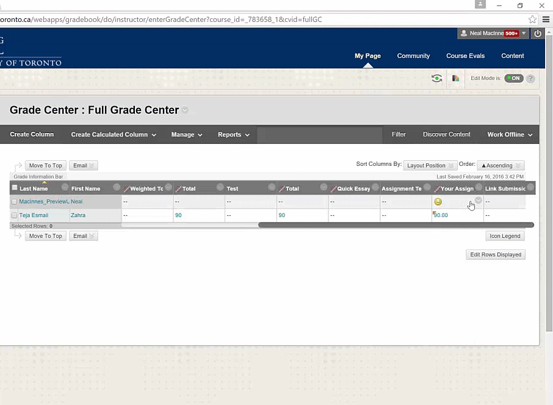

# The Basics of Working with the Grade Center

**A Quiet Evening at Home** via [PhD Comics](http://www.phdcomics.com/comics.php?f=973)

## Introduction
The following information will highlight some of the key ways we use the Blackboard Grade Center at the Faculty of Nursing.

The Grade Center provides functionality for marking your students' work and sharing feedback and grades with them. It is the best way to manage your grading and can save you lots of time in communicating with your students as well as in receiving their work.

The Grade Center is a table that can be sorted and organized according to your own preferences. It can also be downloaded as an excel document and then re-uploaded if you prefer to complete your marking offline.

By default, a Grade Center column is created when you create assignments, tests, and surveys in your Blackboard course. For tests and other items that don't have a submission component in Blackboard you can manually create Grade Center columns for these items. These steps are best done at the beginning of term.

## Hiding and Releasing Grades to Students
It can be a good idea to hide Grade Center Columns as this will allow you to mark all student's before making the grades accessible so everyone receives their grade at the same time. In order to do this you can click on the chevron at the top of the column you want to hide and then click on the _Hide from Students (on/off)_ option. When you are ready to release the grades you repeat the process thereby revealing the column. Note that there will be a small red slash at the top of the column if it is hidden from students.

**Hiding an assignment**

**Revealing an assignment once graded**

## Grading an Assignment
Once an assignment has been submitted by your students you will see an icon in the Grade Center column for the assignment indicating that that submission needs grading. This icon is a yellow circle with an exclamation mark. By clicking on the chevron in the column cell you will be able to input a grade for that assignment and provide some feedback.You can attach files when giving feedback by clicking on the paper clip icon in the text box. _Note: If assignments are submitted or tests are done offline outside of blackboard these icons will not appear and you will have to enter the mark manually into the column by clicking in the cell._

**Grading a Submission**

## Student View

Students will only be able to see their own grades once you have made the column visible. They can access their grades and feedback by clicking on the _My Grades_ tab in their course. If you have attached a file to their feedback for example their paper with comments they will also be able to access it from this area by clicking the feedback icon (a speech bubble) located next to their numerical grade.

**Student view of _My Grades_ in their course**
